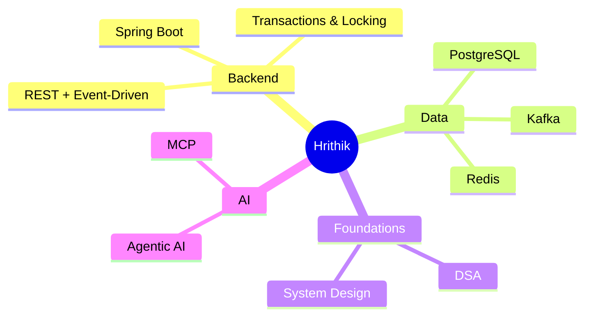

<!-- ===================== HEADER: animated typing banner ===================== -->
<div align="center">

  <a href="https://git.io/typing-svg">
    
  </a>

  <br/>

  <!-- Visitor counter -->
  

  <!-- Social badges -->
  <a href="https://www.linkedin.com/in/YOUR-LINKEDIN/">
    
  </a>
  <a href="mailto:YOUR-EMAIL@example.com">
    
  </a>
  <a href="https://leetcode.com/YOUR-HANDLE/">
    
  </a>

</div>

---

## 🧑‍💻 About Me

```java
public class Hrithik extends Engineer {

    @Override
    public Focus currentFocus() {
        return Focus.builder()
            .role("Java Backend Engineer")
            .building("Scalable, secure REST & event-driven services")
            .learning(List.of("Distributed Systems", "Kafka", "Agentic AI"))
            .solving("DSA daily — one pattern at a time")
            .motto("Make it correct, then make it fast.")
            .build();
    }
}
```

- 🔭 I work with **Spring Boot**, **PostgreSQL**, **Kafka**, and **AWS Lambda**.
- 🌱 Currently going deep on **concurrency, locking, and system scaling**.
- 🧩 Sharpening **Data Structures & Algorithms** — sliding window, recursion, bit manipulation.
- 🤖 Exploring **Agentic AI** and the **Model Context Protocol (MCP)**.
- 💬 Ask me about **transactions, JPA mappings, or why you should never store money in a `double`.**

---

## 🛠️ Tech Stack

<div align="center">

### Languages


### Frameworks & Tools


### Data & Messaging


### Cloud & DevOps


</div>

---

## 📊 GitHub in Numbers

<div align="center">

  
  

  <br/>

  

  <br/>

  

</div>

---

## 🐍 Contribution Activity

<!--
  This needs a GitHub Action to generate the snake animation.
  See setup instructions in the collapsible section below.
-->
<div align="center">
  
</div>

<details>
  <summary>⚙️ How to enable the snake animation</summary>

  Create `.github/workflows/snake.yml` in your profile repo:

  ```yaml
  name: Generate Snake

  on:
    schedule:
      - cron: "0 0 * * *"   # daily
    workflow_dispatch:

  jobs:
    generate:
      runs-on: ubuntu-latest
      steps:
        - uses: Platane/snk/svg-only@v3
          with:
            github_user_name: ${{ github.repository_owner }}
            outputs: |
              dist/github-contribution-grid-snake-dark.svg?palette=github-dark
        - uses: crazy-max/ghaction-github-pages@v4
          with:
            target_branch: output
            build_dir: dist
          env:
            GITHUB_TOKEN: ${{ secrets.GITHUB_TOKEN }}
  ```
</details>

---

## 🚀 What I'm Building

<details open>
  <summary><b>🏦 ATM Banking Service</b> — concurrency done right</summary>

  Spring Boot + PostgreSQL. Deposit/withdraw APIs with **pessimistic row locking**
  (`SELECT ... FOR UPDATE`), optimistic `@Version` backstop, idempotency keys, and a
  transaction ledger. Proof that two withdrawals can't overdraft the same account.
</details>

<details>
  <summary><b>🎟️ TicketHub</b> — booking under load</summary>

  Event/seat booking platform exploring every JPA mapping, seat-hold expiry,
  caching, JWT security, and Kafka-driven notifications.
</details>

<details>
  <summary><b>🤖 Agentic AI in Java</b> — tools, LLMs & MCP</summary>

  A from-scratch agent loop with a tool registry, plus a Spring AI MCP server.
</details>

---

## 🧠 Currently Learning



---

<div align="center">

  

  <br/><br/>

  <i>“First, solve the problem. Then, write the code.” — John Johnson</i>

  <br/><br/>

  ⭐️ From [ihrithiksonar](https://github.com/ihrithiksonar)

</div>

